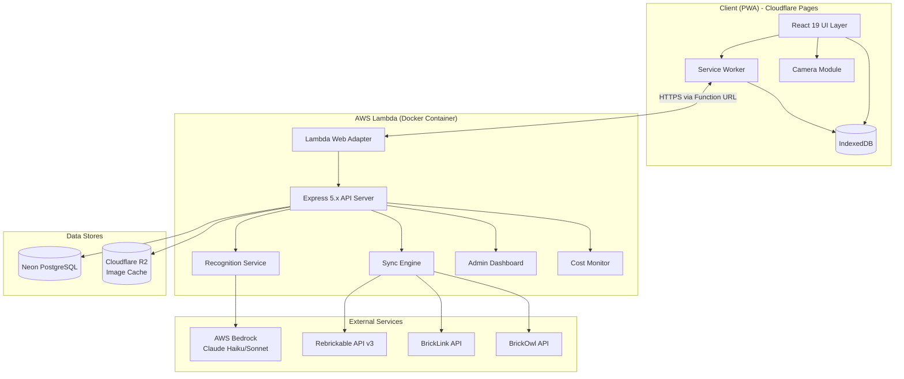
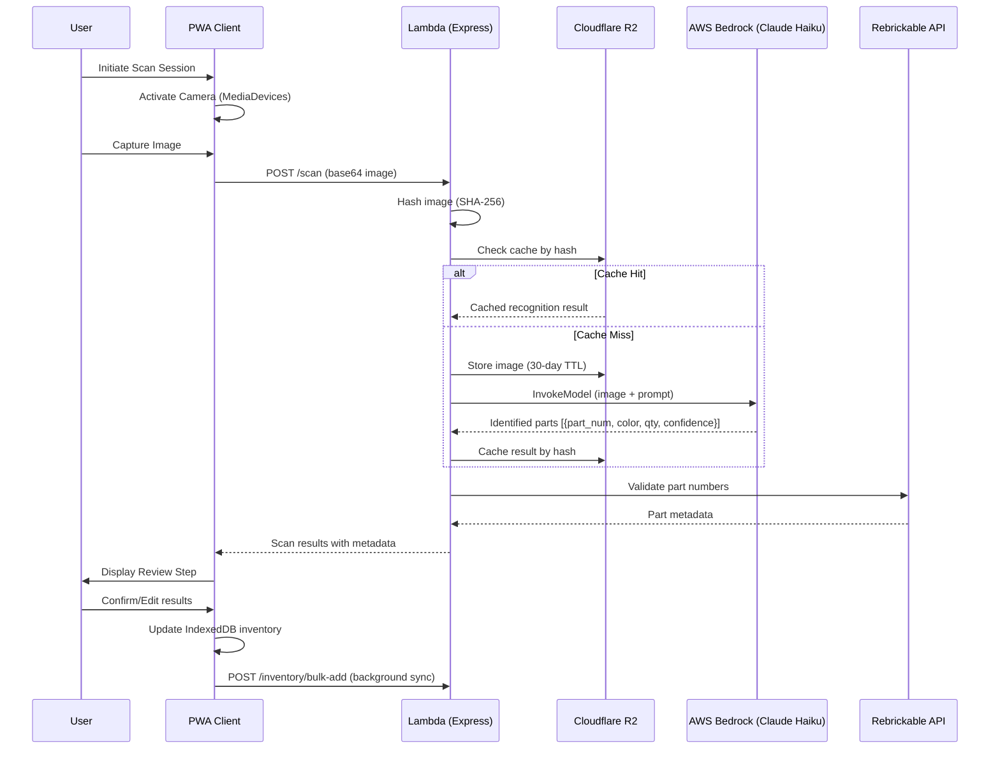
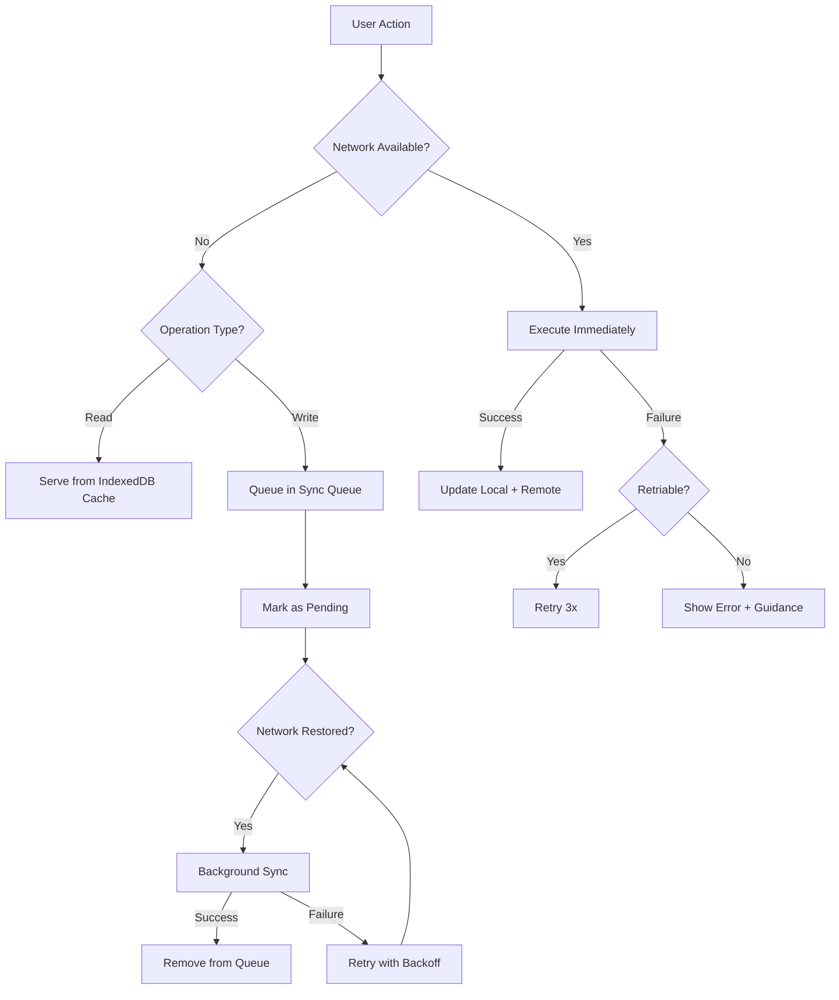

# Design Document: LEGO MOC Builder

## Overview

The LEGO MOC Builder is a Progressive Web App (PWA) that enables LEGO enthusiasts to manage their brick collections, discover community MOC designs, find alternative rebuild ideas, and get display inspiration. The application uses a camera-first approach with AI-powered brick recognition (AWS Bedrock with Claude Vision), integrates with Rebrickable API for catalog data, and supports offline-first operation with background synchronization.

The backend is deployed as a standard Docker container on AWS Lambda using the Lambda Web Adapter, ensuring full code portability with zero Lambda-specific handler code. See [ADR-001](../../docs/adr/001-infrastructure-and-deployment.md) for the full infrastructure decision record.

### Key Design Decisions

| Decision | Choice | Rationale |
|----------|--------|-----------|
| Platform | PWA (Progressive Web App) | Camera access via MediaDevices API, offline support via Service Workers + IndexedDB, cross-platform without app store submission, installable on home screen. Avoids native app distribution complexity for a personal-use tool. |
| Runtime | Node.js 24 LTS | Latest active LTS version with long-term support until April 2028 |
| Frontend Framework | React 19 with TypeScript 5.x | Strong PWA ecosystem, rich component libraries, TypeScript for type safety across the brick domain model |
| Build Tool | Vite 6.x | Fast builds, native ESM, excellent React/TypeScript support |
| Backend Framework | Express 5.x with TypeScript 5.x | Standard HTTP framework, runs in Docker container, fully portable |
| ORM | Drizzle ORM | Type-safe, lightweight, excellent Postgres support, no code generation step |
| Package Manager | pnpm 9.x | Fast, disk-efficient, strict dependency resolution |
| Backend Hosting | AWS Lambda (Docker container via Web Adapter) | $0/month always-free tier (1M requests), standard Express code with zero Lambda-specific handlers |
| Frontend Hosting | Cloudflare Pages | $0/month, unlimited bandwidth, auto-deploy from GitHub |
| Database | Neon (Serverless PostgreSQL) | $0/month always-free tier, scale-to-zero, standard Postgres wire protocol |
| Image Storage | Cloudflare R2 | $0/month (10 GB free), S3-compatible API, zero egress fees |
| AI Recognition | AWS Bedrock (Claude Haiku default, Sonnet for ambiguous) | Pre-trained multimodal model, no custom training needed, tiered model strategy for cost control |
| Primary Data Source | Rebrickable API v3 | Comprehensive parts/sets/colors catalog, alternate builds support, free API tier. Note: MOC inventories are no longer available via API - only alternate builds of sets are supported. |
| Supplementary Data | BrickLink API + BrickOwl API | Pricing/availability data, "buy missing parts" links for users |
| Offline Strategy | IndexedDB + Service Worker | Full catalog cached locally, inventory operations work offline, background sync when connection restored |
| Authentication | JWT with refresh tokens | Stateless auth for API, supports invite-only sharing model |
| Cost Strategy | Tiered model selection + usage quotas | Use cheapest model (Haiku) for initial scans, escalate to Sonnet for ambiguous cases. Daily scan limits prevent runaway costs. |
| Infrastructure-as-Code | AWS SAM + Terraform | SAM for Lambda lifecycle; Terraform for ECR, Secrets Manager, Cloudflare, Neon resources. State in Terraform Cloud, applied via GitHub Actions. |
| CI/CD | GitHub Actions | Build Docker image, push to ECR, deploy Lambda; deploy frontend to Cloudflare Pages |
| Container Registry | AWS ECR | 500 MB always-free tier, integrated with Lambda |

### Architecture Style

The application follows a **local-first architecture** where data lives primarily on the client (IndexedDB) and syncs to the server for backup, sharing, and AI recognition processing. This ensures the app remains functional during network interruptions - critical for a user scanning bricks in storage areas that may have poor connectivity.

## Architecture



### Data Flow: Brick Scanning



## Components and Interfaces

### Client-Side Components

#### 1. Camera Module
- **Responsibility**: Camera access, image capture, image preprocessing
- **Interface**:
  ```typescript
  interface CameraModule {
    requestPermission(): Promise<PermissionStatus>;
    startCapture(): Promise<MediaStream>;
    captureImage(): Promise<CapturedImage>;
    stopCapture(): void;
  }
  
  interface CapturedImage {
    dataUrl: string;       // base64 encoded image
    width: number;
    height: number;
    timestamp: Date;
  }
  ```

#### 2. Recognition Client
- **Responsibility**: Communicate with backend recognition service, handle results
- **Interface**:
  ```typescript
  interface RecognitionClient {
    identifyBricks(image: CapturedImage): Promise<ScanResult>;
    getStatus(): Promise<ServiceStatus>;
  }
  
  interface ScanResult {
    sessionId: string;
    identifiedBricks: IdentifiedBrick[];
    processingTimeMs: number;
  }
  
  interface IdentifiedBrick {
    partNumber: string;
    colorId: number;
    colorName: string;
    quantity: number;
    confidence: number;  // 0.0 to 1.0
    boundingBox?: BoundingBox;
    needsReview: boolean; // true if confidence < 0.7
  }
  ```

#### 3. Inventory Store (IndexedDB)
- **Responsibility**: Local-first inventory persistence, offline access
- **Interface**:
  ```typescript
  interface InventoryStore {
    addBricks(bricks: BrickEntry[]): Promise<void>;
    removeBricks(partNumber: string, colorId: number, quantity: number, bagNumber?: number): Promise<void>;
    getBricksByFilter(filter: InventoryFilter): Promise<BrickEntry[]>;
    getTotalCount(): Promise<InventorySummary>;
    getBrickLocations(partNumber: string, colorId?: number): Promise<BagLocation[]>;
  }
  
  interface BrickEntry {
    id: string;
    partNumber: string;
    colorId: number;
    colorName: string;
    categoryId: number;
    categoryName: string;
    quantity: number;
    status: 'available' | 'in-use' | 'in-storage';
    bagNumber?: number;
    sourceSetNumber?: string;
    lastModified: Date;
  }
  ```

#### 4. Sync Engine (Client)
- **Responsibility**: Background synchronization between IndexedDB and server
- **Interface**:
  ```typescript
  interface SyncEngine {
    scheduleSync(): void;
    forceSyncNow(): Promise<SyncResult>;
    getLastSyncTime(): Date | null;
    getPendingChanges(): Promise<number>;
  }
  ```

#### 5. Catalog Cache
- **Responsibility**: Local cache of Rebrickable catalog data
- **Interface**:
  ```typescript
  interface CatalogCache {
    searchParts(query: string, limit?: number): Promise<CatalogPart[]>;
    searchSets(query: string, limit?: number): Promise<CatalogSet[]>;
    getPartByNumber(partNumber: string): Promise<CatalogPart | null>;
    getSetByNumber(setNumber: string): Promise<CatalogSet | null>;
    getSetParts(setNumber: string): Promise<SetPart[]>;
    getLastSyncTime(): Date | null;
  }
  ```

### Server-Side Components

#### 6. API Server
- **Responsibility**: REST API gateway, authentication, request routing
- **Key Endpoints**:
  ```
  POST   /api/auth/register
  POST   /api/auth/login
  POST   /api/auth/refresh
  
  POST   /api/scan/identify         - Submit image for recognition
  GET    /api/scan/sessions/:id     - Get scan session results
  
  GET    /api/inventory             - Get user inventory
  POST   /api/inventory/bulk-add    - Add bricks in bulk
  PATCH  /api/inventory/:id         - Update brick entry
  DELETE /api/inventory/:id         - Remove brick entry
  
  GET    /api/sets                  - Get user's set collection
  POST   /api/sets                  - Add set to collection
  PATCH  /api/sets/:id/status       - Update set build status
  DELETE /api/sets/:id              - Remove set
  
  GET    /api/bags                  - Get all storage bags
  POST   /api/bags                  - Create new bag
  POST   /api/bags/:id/bricks      - Assign bricks to bag
  DELETE /api/bags/:id/bricks/:brickId - Remove brick from bag
  
  GET    /api/mocs                  - Browse/search MOCs
  GET    /api/mocs/:id              - Get MOC details
  GET    /api/mocs/:id/buildability - Check part coverage
  POST   /api/mocs/wishlist         - Save to wishlist
  
  GET    /api/rebuilds              - Get rebuild ideas for sets
  GET    /api/rebuilds/:id          - Get rebuild idea details
  
  GET    /api/display-ideas         - Get display suggestions
  POST   /api/display-ideas/favorites - Save favorites
  
  GET    /api/sharing               - Get sharing settings
  POST   /api/sharing/invite        - Invite user
  DELETE /api/sharing/revoke/:userId - Revoke access
  GET    /api/shared/:userId        - View shared content
  ```

#### 7. Recognition Service
- **Responsibility**: Pluggable AI brick identification
- **Interface**:
  ```typescript
  interface RecognitionBackend {
    identify(image: Buffer, options?: RecognitionOptions): Promise<RecognitionResult>;
    getServiceHealth(): Promise<HealthStatus>;
  }
  
  interface BedrockClaudeBackend implements RecognitionBackend {
    // Uses AWS Bedrock InvokeModel API with Claude's vision capabilities
    // Sends image with a structured prompt requesting part identification
    // Returns structured JSON with identified parts
  }
  
  interface RecognitionOptions {
    maxParts?: number;        // limit identified parts
    minConfidence?: number;   // minimum confidence threshold
    includeAlternatives?: boolean; // include alternative identifications
  }
  
  interface RecognitionResult {
    parts: RecognizedPart[];
    processingTimeMs: number;
    modelVersion: string;
  }
  ```

#### 8. Catalog Sync Service
- **Responsibility**: Periodic synchronization with Rebrickable API
- **Interface**:
  ```typescript
  interface CatalogSyncService {
    checkForUpdates(): Promise<boolean>;
    syncParts(): Promise<SyncStatus>;
    syncSets(): Promise<SyncStatus>;
    syncColors(): Promise<SyncStatus>;
    getLastSync(): Date;
    scheduleNextSync(): void;
  }
  ```

#### 9. Part Coverage Calculator
- **Responsibility**: Calculate buildability percentage for MOCs and rebuild ideas
- **Interface**:
  ```typescript
  interface PartCoverageCalculator {
    calculateCoverage(requiredParts: RequiredPart[], availableInventory: BrickEntry[]): CoverageResult;
  }
  
  interface RequiredPart {
    partNumber: string;
    colorId: number;
    quantity: number;
  }
  
  interface CoverageResult {
    percentage: number;         // 0-100, rounded to nearest whole number
    matchedParts: number;
    totalRequired: number;
    missingParts: MissingPart[];
  }
  
  interface MissingPart {
    partNumber: string;
    colorId: number;
    colorName: string;
    quantityNeeded: number;
    quantityOwned: number;
  }
  ```

#### 10. Sharing Service
- **Responsibility**: Manage sharing permissions and invite-only access
- **Interface**:
  ```typescript
  interface SharingService {
    createShare(ownerId: string, options: ShareOptions): Promise<ShareLink>;
    inviteUser(shareId: string, inviteeUsername: string): Promise<void>;
    revokeAccess(shareId: string, userId: string): Promise<void>;
    checkAccess(shareId: string, userId: string): Promise<boolean>;
    getSharedContent(shareId: string, userId: string): Promise<SharedView>;
  }
  
  interface ShareOptions {
    includeCollection: boolean;
    includeInventory: boolean;
    maxInvitees?: number; // default 20
  }
  ```

## Data Models

### Entity Relationship Diagram

```mermaid
erDiagram
    USER ||--o{ SET_COLLECTION : owns
    USER ||--o{ BRICK_INVENTORY : has
    USER ||--o{ STORAGE_BAG : creates
    USER ||--o{ SHARE : creates
    USER ||--o{ MOC_WISHLIST : saves
    USER ||--o{ DISPLAY_FAVORITE : saves
    
    SET_COLLECTION ||--|{ SET_BRICK : contains
    BRICK_INVENTORY }o--|| STORAGE_BAG : stored_in
    
    SHARE ||--o{ SHARE_INVITE : has
    SHARE_INVITE }o--|| USER : invited_user
    
    CATALOG_PART ||--o{ CATALOG_COLOR : available_in
    CATALOG_SET ||--|{ CATALOG_SET_PART : contains
    
    USER {
        uuid id PK
        string username UK
        string email UK
        string password_hash
        timestamp created_at
        timestamp last_login
    }
    
    SET_COLLECTION {
        uuid id PK
        uuid user_id FK
        string set_number
        string name
        string theme
        int year
        int piece_count
        string status "built|disassembled|partial"
        boolean is_duplicate
        timestamp added_at
    }
    
    BRICK_INVENTORY {
        uuid id PK
        uuid user_id FK
        string part_number
        int color_id
        int quantity
        string status "available|in-use|in-storage"
        int bag_number "nullable"
        string source_set_number "nullable"
        timestamp last_modified
    }
    
    STORAGE_BAG {
        uuid id PK
        uuid user_id FK
        int bag_number
        timestamp created_at
    }
    
    SHARE {
        uuid id PK
        uuid owner_id FK
        string share_link UK
        boolean include_collection
        boolean include_inventory
        timestamp created_at
    }
    
    SHARE_INVITE {
        uuid id PK
        uuid share_id FK
        uuid invited_user_id FK
        timestamp invited_at
        timestamp revoked_at "nullable"
    }
    
    MOC_WISHLIST {
        uuid id PK
        uuid user_id FK
        string moc_id
        string title
        string thumbnail_url
        string designer
        int piece_count
        timestamp saved_at
    }
    
    DISPLAY_FAVORITE {
        uuid id PK
        uuid user_id FK
        string display_idea_id
        string title
        string category
        timestamp saved_at
    }
    
    CATALOG_PART {
        string part_number PK
        string name
        int category_id
        string category_name
        string image_url
        timestamp last_synced
    }
    
    CATALOG_COLOR {
        int color_id PK
        string name
        string hex_code
        boolean is_transparent
    }
    
    CATALOG_SET {
        string set_number PK
        string name
        string theme
        int year
        int piece_count
        string image_url
        timestamp last_synced
    }
    
    CATALOG_SET_PART {
        uuid id PK
        string set_number FK
        string part_number FK
        int color_id FK
        int quantity
        boolean is_spare
    }
}
```

### IndexedDB Schema (Client-Side)

```typescript
interface LocalDBSchema {
  inventory: {
    key: string;      // composite: `${partNumber}_${colorId}_${bagNumber}`
    value: BrickEntry;
    indexes: {
      'by-part': string;
      'by-color': number;
      'by-bag': number;
      'by-status': string;
      'by-category': number;
    };
  };
  sets: {
    key: string;       // set_number
    value: LocalSet;
    indexes: {
      'by-theme': string;
      'by-status': string;
    };
  };
  catalogParts: {
    key: string;       // part_number
    value: CatalogPart;
    indexes: {
      'by-name': string;
      'by-category': number;
    };
  };
  catalogSets: {
    key: string;       // set_number
    value: CatalogSet;
    indexes: {
      'by-name': string;
      'by-theme': string;
    };
  };
  syncQueue: {
    key: string;       // auto-generated
    value: SyncOperation;
    indexes: {
      'by-timestamp': number;
      'by-status': string;
    };
  };
  mocWishlist: {
    key: string;
    value: WishlistEntry;
  };
  displayFavorites: {
    key: string;
    value: DisplayFavoriteEntry;
  };
}
```


## Correctness Properties

*A property is a characteristic or behavior that should hold true across all valid executions of a system — essentially, a formal statement about what the system should do. Properties serve as the bridge between human-readable specifications and machine-verifiable correctness guarantees.*

### Property 1: Part Coverage Calculation Correctness

*For any* MOC or Rebuild_Idea parts list and *for any* user inventory, the Part_Coverage percentage SHALL equal `(number of required parts where inventory has >= required quantity, matched by part number AND color) / (total number of distinct required part-color pairs) * 100`, rounded to the nearest whole number. Additionally, the missing parts list SHALL contain exactly those part-color pairs where the required quantity exceeds the available inventory quantity, with `quantityNeeded = required - owned`.

**Validates: Requirements 5.4, 5.5, 6.4**

### Property 2: Inventory Quantity Arithmetic

*For any* valid brick addition (from scan confirmation, set import, or manual entry) with quantity Q to an inventory containing quantity N of that brick, the resulting inventory SHALL contain quantity N + Q of that brick. *For any* valid removal of quantity R where R <= available quantity N, the resulting quantity SHALL be N - R. *For any* removal where R > N, the operation SHALL be rejected and the inventory SHALL remain unchanged.

**Validates: Requirements 1.6, 1.11, 1.12, 2.2, 2.6**

### Property 3: Set Status and Brick Availability Round-Trip

*For any* set in the collection, marking it as "built" SHALL transition all of that set's bricks to "in-use" status, and subsequently marking the same set as "disassembled" SHALL transition those bricks back to "available" status, restoring the original availability state.

**Validates: Requirements 2.3, 2.4**

### Property 4: Inventory Status Count Invariant

*For any* inventory state, the total brick count SHALL equal the sum of available count + in-use count + in-storage count. No brick entry shall exist with a status other than these three values.

**Validates: Requirements 2.5**

### Property 5: Set Build Conflict Detection

*For any* set being marked as "built" where one or more of its bricks already have status "in-use" or "in-storage" in the inventory, the conflict notification SHALL list exactly those bricks whose current status is not "available", along with their current status and quantities.

**Validates: Requirements 2.7**

### Property 6: Storage Bag Sequential Numbering

*For any* sequence of N bag creations by a user, the resulting bag numbers SHALL be exactly the set {1, 2, ..., N} with no gaps and no duplicates, regardless of the order or timing of creation.

**Validates: Requirements 3.1**

### Property 7: Brick-to-Bag Association and Lookup

*For any* brick stored in one or more bags, querying that brick's locations SHALL return all bag numbers containing that brick with the correct quantity per bag. The sum of quantities across all bags for a given brick SHALL equal the total "in-storage" quantity of that brick in the inventory.

**Validates: Requirements 3.2, 3.3, 3.8**

### Property 8: Bag Removal Correctness

*For any* removal of quantity R of a brick from a bag containing quantity N of that brick (where R <= N), the resulting quantity in that bag SHALL be N - R. If N - R equals zero, the brick-bag association SHALL be removed entirely.

**Validates: Requirements 3.4, 3.5**

### Property 9: Bag Overview Statistics

*For any* storage bag, the displayed distinct brick type count SHALL equal the number of unique part-number/color combinations in that bag, and the total brick count SHALL equal the sum of all quantities across all brick entries in that bag.

**Validates: Requirements 3.7**

### Property 10: Confidence Threshold Flagging

*For any* set of identified bricks from a recognition result, exactly those bricks with a confidence value strictly less than 0.70 SHALL be flagged as `needsReview: true`, and all others SHALL have `needsReview: false`.

**Validates: Requirements 1.7**

### Property 11: Username and Password Validation

*For any* string, username validation SHALL accept it if and only if it is 3-30 characters long and contains only alphanumeric characters and underscores. Password validation SHALL accept it if and only if it is at least 8 characters long and contains at least one uppercase letter, one lowercase letter, and one digit.

**Validates: Requirements 8.1**

### Property 12: Access Control Membership

*For any* shared content and *for any* user, access SHALL be granted if and only if the user appears in the active invite list for that share (not revoked). After revocation, the user SHALL no longer appear in the active invite list and access SHALL be denied.

**Validates: Requirements 8.3, 8.5, 8.6**

### Property 13: Cross-Domain Search with AND-Logic Filters

*For any* search query of 2+ characters and *for any* combination of applied filters, all returned results SHALL (a) match the query against at least one of: name, part number, set number, theme, or designer, AND (b) satisfy ALL applied filter criteria simultaneously.

**Validates: Requirements 10.1, 10.3**

### Property 14: Result Set Pagination Cap

*For any* search or browse operation, the returned results per page SHALL not exceed 50 items. For set searches, results SHALL be capped at 50 per query. This cap SHALL apply independently per domain (Inventory, Collection, MOCs, Rebuild_Ideas).

**Validates: Requirements 10.7, 4.3, 5.1**

### Property 15: Buildability Sort Order

*For any* list of MOCs displayed to a user with a loaded inventory, they SHALL be sorted by Part_Coverage in descending order. *For any* list of Rebuild_Ideas for selected sets, they SHALL be filtered to only include those with Part_Coverage >= 50% and sorted by Part_Coverage in descending order.

**Validates: Requirements 5.6, 6.1**

## Error Handling

### Error Categories and Strategies

| Category | Examples | Strategy |
|----------|----------|----------|
| **Network Errors** | API timeouts, connection lost | Retry with exponential backoff (max 3 attempts), fall back to cached data, queue operations for background sync |
| **Recognition Errors** | Service unavailable, timeout (>10s), malformed response | Display user-friendly error, offer retry or manual entry fallback |
| **Validation Errors** | Invalid part numbers, exceeded limits, format violations | Immediate client-side feedback with specific error messages |
| **Conflict Errors** | Duplicate sets, brick availability conflicts | Present conflict details to user with resolution options (confirm/cancel) |
| **Permission Errors** | Unauthorized sharing access, expired tokens | Redirect to login, clear stale tokens, display access denied message |
| **Storage Errors** | IndexedDB quota exceeded, sync failures | Notify user of storage limits, offer data export, retry sync |

### Offline Error Handling



### Recognition Service Error Handling

- **Timeout (>10s)**: Cancel request, display "Recognition is taking longer than expected", offer retry
- **Service unavailable**: Display "Recognition service is temporarily unavailable", offer manual entry
- **No bricks detected**: Display "No bricks detected in this image — try adjusting angle or lighting", offer recapture
- **Low confidence (<70%)**: Flag individual bricks in Review Step with visual indicator, pre-fill search for manual correction

### Catalog Sync Retry Strategy

1. **Initial failure**: Log error, schedule retry in 1 hour
2. **Second failure**: Log warning, schedule retry in 1 hour
3. **Third failure**: Log error, notify user "Catalog data may be outdated", serve cached data
4. **Next scheduled sync (12h)**: Reset retry counter, attempt fresh sync

## Cost Management

### AI Recognition Cost Controls

The Recognition Service uses a **tiered model strategy** to minimize costs while maintaining quality:

| Model Tier | Use Case | Approximate Cost per Scan | When Used |
|------------|----------|---------------------------|-----------|
| Claude Haiku | Initial brick identification | ~$0.005–$0.01 | Default for all scans |
| Claude Sonnet | Ambiguous or low-confidence results | ~$0.02–$0.05 | Only when Haiku confidence < 50% on multiple bricks |

### Usage Quotas

```typescript
interface UsageQuota {
  scansPerDay: number;         // Default: 50 per user
  scansPerMonth: number;       // Default: 500 per user
  maxImageSizeMB: number;      // Default: 5 MB (larger images resized before sending)
  maxBricksPerScan: number;    // Default: 100 (limits prompt/response tokens)
}
```

### Budget Controls

1. **AWS CloudWatch Budget Alarms**: Set threshold at $10/month for Bedrock usage (personal app scale)
2. **Daily spend cap**: If daily Bedrock spend exceeds $2, disable AI scanning and show "daily limit reached" message
3. **Usage tracking**: Store scan count and estimated cost per user per day in PostgreSQL
4. **Admin dashboard visibility**: Display running monthly cost, average cost per scan, total scans

### Cost Optimization Strategies

- **Image preprocessing**: Resize images to max 1024px before sending (reduces token count)
- **Result caching**: Cache recognition results keyed by image hash — if same image re-scanned, serve cached result
- **Batch validation**: Validate identified part numbers against local catalog cache before calling Rebrickable API
- **Rebrickable API rate management**: Free tier allows 100 requests/minute — use request queuing to stay within limits

### External API Cost Summary

| Service | Free Tier | Paid Tier | Our Expected Usage |
|---------|-----------|-----------|-------------------|
| Rebrickable API | 100 req/min, unlimited | N/A (free) | Catalog sync + alternate builds lookup |
| AWS Bedrock (Haiku) | None (pay per token) | ~$0.25/MTok input, $1.25/MTok output | 50 scans/day × ~1K tokens = ~$0.50/month |
| BrickLink API | Yes (limited) | Contact for higher limits | Pricing data for "buy missing parts" |
| BrickOwl API | 600 req/min | N/A (free with account) | Supplementary pricing comparisons |

## MOC Discovery Scope

### Rebrickable API Limitations

The Rebrickable API v3 **no longer provides MOC inventories** (parts lists for community-created MOCs) through the API, except for alternate builds of official sets. This affects our MOC Discovery feature.

### Strategy for MOC Content

| Feature | Data Source | Approach |
|---------|-------------|----------|
| Alternate Rebuild Ideas | Rebrickable API `/lego/sets/{set_num}/alternates/` | ✅ Fully supported — parts lists available |
| Community MOC Browsing | Rebrickable website (not API) | Display MOC titles, images, links — redirect to Rebrickable for full details |
| MOC Buildability Check | Rebrickable alternate builds only | Full Part_Coverage calculation available for alternate builds |
| Community MOC Part_Coverage | Not feasible via API | Show "View on Rebrickable" link where users can check buildability on the site |

### Implications for Requirements

- **Requirement 5 (MOC Discovery)**: Fully supported for alternate builds of owned sets. For broader community MOCs, the app will display metadata (title, image, designer, link) but redirect to Rebrickable for parts lists and buildability checks.
- **Requirement 6 (Alternative Rebuild Ideas)**: Fully supported — this is Rebrickable's primary API use case for MOC-like content.
- **Part_Coverage calculation**: Only available for alternate builds where we can fetch the full parts list via API.

## Admin Dashboard

### Purpose

A lightweight admin view for the app owner (you) to monitor system health, costs, and usage patterns. Not a full multi-tenant admin panel — tailored for personal/family use.

### Admin Endpoints

```
GET    /api/admin/stats              - Usage statistics (scans, users, costs)
GET    /api/admin/costs              - Current month AI/API spend breakdown
GET    /api/admin/sync-status        - Catalog sync health and last sync times
GET    /api/admin/users              - Registered users and activity summary
POST   /api/admin/quotas             - Update usage quotas
POST   /api/admin/budget-threshold   - Set/update budget alert thresholds
```

### Admin Dashboard Views

1. **Overview**: Total users, total inventory bricks, total scans this month, estimated cost
2. **Cost Monitor**: Daily/monthly spend chart, per-service breakdown (Bedrock, Rebrickable), budget alerts status
3. **Sync Health**: Last catalog sync time, sync success/failure history, next scheduled sync
4. **User Activity**: Scans per user, collection sizes, sharing activity (no personal inventory data exposed)

### Access Control

Admin role is a simple boolean flag on the user record. Only the first registered user (app owner) gets admin access by default. Admin endpoints are protected by JWT + admin role check middleware.

## Buy Missing Parts Integration

### Purpose

When a user discovers they're missing bricks for a MOC or Rebuild Idea, provide direct links to purchase those parts from external marketplaces.

### Supported Marketplaces

| Marketplace | Integration Type | Data Available |
|-------------|-----------------|----------------|
| BrickLink | API (pricing + availability) | Price per part, seller listings, direct purchase links |
| BrickOwl | API (pricing + availability) | Price per part, store links |
| Wobrick/Gobricks | Link-out only (no API) | Generate bulk order URL from parts list |

### Interface

```typescript
interface MissingPartsPurchaseService {
  getPricingOptions(missingParts: MissingPart[]): Promise<PurchaseOption[]>;
  generateBrickLinkWantedList(missingParts: MissingPart[]): string; // XML format for BrickLink upload
  generateWobrickBulkUrl(missingParts: MissingPart[]): string;     // URL with part list params
}

interface PurchaseOption {
  partNumber: string;
  colorId: number;
  quantity: number;
  marketplace: 'bricklink' | 'brickowl' | 'wobrick';
  pricePerUnit?: number;    // null if pricing unavailable
  currency?: string;
  directUrl: string;        // link to part on marketplace
  inStock: boolean;
}
```

### User Flow

1. User views missing parts for a MOC/Rebuild Idea
2. App displays "Buy Missing Parts" button
3. On click, app queries BrickLink/BrickOwl APIs for pricing
4. Display options: individual part links, or "Export to BrickLink Wanted List" (XML export compatible with BrickLink's import feature)
5. User clicks through to marketplace to complete purchase

## Testing Strategy

### Testing Approach

The testing strategy uses a dual approach combining property-based tests for universal properties and example-based tests for specific scenarios, edge cases, and integration points.

### Property-Based Testing

**Library**: [fast-check](https://github.com/dubzzz/fast-check) (TypeScript/JavaScript PBT library)

**Configuration**:
- Minimum 100 iterations per property test
- Each property test references its design document property
- Tag format: `Feature: lego-moc-builder, Property {number}: {property_text}`

**Properties to implement**:

| Property | Module Under Test | Key Generators |
|----------|-------------------|----------------|
| 1: Part Coverage Calculation | `PartCoverageCalculator` | Random parts lists, random inventories with varying quantities |
| 2: Inventory Quantity Arithmetic | `InventoryStore` | Random brick entries, random add/remove operations |
| 3: Set Status Round-Trip | `SetCollectionService` | Random sets with random parts lists |
| 4: Status Count Invariant | `InventoryStore` | Random inventories with mixed statuses |
| 5: Conflict Detection | `SetCollectionService` | Random sets where some bricks are pre-allocated |
| 6: Bag Sequential Numbering | `StorageBagService` | Random sequences of create operations |
| 7: Brick-Bag Lookup | `StorageBagService` | Random brick distributions across bags |
| 8: Bag Removal | `StorageBagService` | Random bag contents and removal operations |
| 9: Bag Overview Stats | `StorageBagService` | Random bag contents |
| 10: Confidence Flagging | `RecognitionResultProcessor` | Random confidence values (0.0–1.0) |
| 11: Validation Rules | `AuthValidator` | Random strings (valid/invalid usernames, passwords) |
| 12: Access Control | `SharingService` | Random user sets, invite/revoke sequences |
| 13: Search + Filters | `SearchService` | Random data sets, queries, and filter combinations |
| 14: Pagination Cap | `SearchService`, `MOCService` | Large random result sets |
| 15: Buildability Sort | `MOCService`, `RebuildService` | Random MOCs/rebuilds with varying coverage |

### Unit Tests (Example-Based)

- Camera permission flow (grant/deny)
- Recognition service error scenarios (timeout, unavailable, no results)
- Review Step UI interactions
- Set duplicate detection
- Share creation and invite flow
- Catalog sync retry logic (mock timers)
- Legal disclaimer presence
- Attribution display

### Integration Tests

- AWS Bedrock Claude Vision recognition (2-3 sample brick images)
- Rebrickable API data sync (parts, sets, colors endpoints)
- IndexedDB persistence and retrieval
- Background sync queue processing
- JWT authentication flow

### End-to-End Tests

- Full scan session: camera → recognition → review → inventory
- Set import → build status → disassemble cycle
- MOC discovery → buildability check → wishlist save
- Share creation → invite → view shared content → revoke

### Performance Tests

- Local search response < 2 seconds with 10,000+ inventory items
- Remote search response < 10 seconds
- Recognition response < 10 seconds
- Catalog sync handles 50,000+ parts without memory issues

## Deployment and Infrastructure

For full rationale, see [ADR-001: Infrastructure and Deployment Architecture](../../docs/adr/001-infrastructure-and-deployment.md).

### Monorepo Structure

```
/
├── client/                  # React 19 PWA (Cloudflare Pages)
│   ├── src/
│   ├── public/
│   ├── vite.config.ts
│   └── package.json
├── server/                  # Express 5.x API (Lambda Docker)
│   ├── src/
│   ├── Dockerfile
│   ├── drizzle.config.ts
│   └── package.json
├── shared/                  # Shared TypeScript types
│   ├── src/
│   └── package.json
├── docs/
│   └── adr/                 # Architecture Decision Records
├── .github/
│   └── workflows/           # CI/CD pipelines
├── template.yaml            # AWS SAM template
├── pnpm-workspace.yaml
└── package.json             # Root workspace config
```

### Docker Container (Server)

```dockerfile
FROM node:24-slim

# Lambda Web Adapter - the ONLY Lambda-specific element
COPY --from=public.ecr.aws/awsguru/aws-lambda-web-adapter:0.8.4 /lambda-web-adapter /opt/extensions/lambda-web-adapter

WORKDIR /app
COPY package.json pnpm-lock.yaml ./
RUN corepack enable && pnpm install --frozen-lockfile --prod
COPY dist/ ./dist/

EXPOSE 8080
CMD ["node", "dist/server.js"]
```

### AWS SAM Template (Infrastructure-as-Code)

```yaml
AWSTemplateFormatVersion: '2010-09-09'
Transform: AWS::Serverless-2016-10-31
Description: LEGO MOC Builder Backend API

Globals:
  Function:
    Timeout: 30
    MemorySize: 512

Resources:
  LegoApiFunction:
    Type: AWS::Serverless::Function
    Properties:
      PackageType: Image
      Architectures:
        - arm64
      FunctionUrlConfig:
        AuthType: NONE
      Environment:
        Variables:
          NODE_ENV: production
          PORT: '8080'
    Metadata:
      DockerTag: latest
      DockerContext: ./server
      Dockerfile: Dockerfile

Outputs:
  ApiUrl:
    Description: Lambda Function URL
    Value: !GetAtt LegoApiFunctionUrl.FunctionUrl
```

### CI/CD Pipelines (GitHub Actions)

**Frontend deployment** (on changes to `/client/**`):
1. Install pnpm + Node.js 22 LTS
2. Run lint + type check
3. Run unit tests + property-based tests
4. Build production bundle (`pnpm run build`)
5. Deploy to Cloudflare Pages via `wrangler pages deploy`

**Backend deployment** (on changes to `/server/**`):
1. Install pnpm + Node.js 22 LTS
2. Run lint + type check
3. Run unit tests + property-based tests
4. Build TypeScript (`pnpm run build`)
5. Build Docker image
6. Push to AWS ECR
7. Update Lambda function to use new image

**Shared types** (on changes to `/shared/**`):
1. Triggers both frontend and backend pipelines

### Environment Configuration

| Variable | Service | Description |
|----------|---------|-------------|
| `DATABASE_URL` | Neon | PostgreSQL connection string (stored in AWS Secrets Manager) |
| `R2_ACCOUNT_ID` | Cloudflare | R2 account identifier |
| `R2_ACCESS_KEY_ID` | Cloudflare | R2 S3-compatible access key |
| `R2_SECRET_ACCESS_KEY` | Cloudflare | R2 S3-compatible secret key |
| `R2_BUCKET_NAME` | Cloudflare | R2 bucket name (lego-scan-images) |
| `REBRICKABLE_API_KEY` | Rebrickable | API key for catalog data access |
| `JWT_SECRET` | App | Token signing secret |
| `AWS_REGION` | AWS | Region for Bedrock calls (us-east-1) |

### DNS Configuration (Cloudflare)

```
CNAME  lego      lego-moc-builder.pages.dev          # Frontend
CNAME  lego-api  <lambda-function-url-domain>         # Backend API
```

### Version Pinning Policy

All dependencies use exact versions (no `^` or `~` ranges) in `package.json` to ensure reproducible builds. Updates are managed via automated tooling (Renovate or Dependabot) with PR-based review.

| Dependency | Pinned Version | LTS End Date |
|------------|---------------|--------------|
| Node.js | 24.x | April 2028 |
| React | 19.x | Current stable |
| Express | 5.x | Current stable |
| TypeScript | 5.x | Current stable |
| Vite | 6.x | Current stable |
| Drizzle ORM | Latest stable | Rolling |
| pnpm | 9.x | Current stable |
| fast-check | Latest stable | Rolling |
| Vitest | Latest stable | Rolling |
